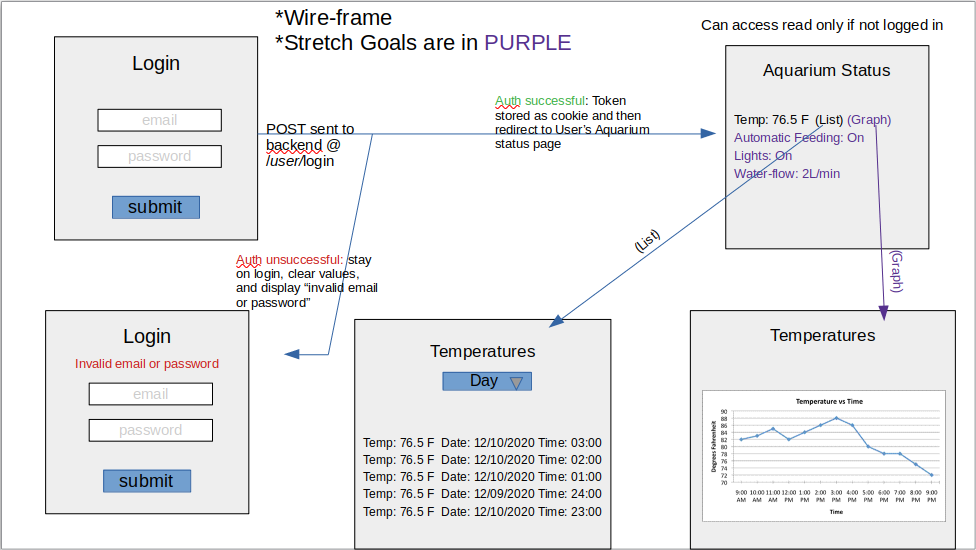

# AquaPi Backend

## Description
AquaPi is an automated aquarium controller that can monitor and manage a variety of aquarium components. Built with a RaspberryPi single board computer and some sensors, the AquaPi framework is extremely customizable and affordable. The frontend was built with React while the backend is handled by Django with a Postgresql DB. Excited….? Checkout deployed application and all the related github repos below.

- Deployed frontend https://aquapi.herokuapp.com/
- Deployed backend https://mighty-lake-45709.herokuapp.com/
- https://github.com/d-e-k-k/aquapi_frontend 
- https://github.com/d-e-k-k/aquapi_backend
- https://github.com/d-e-k-k/aquapi_aquarium_controller

## Original Wireframe
 

## User stories

- As a hobbyist aquarium owner, I would like to be able to remotely check the status of my aquarium.
- As a user, I would like to be able to see this info on a web page or cellular application so I can be confident my aquarium is okay even when I’m not home.
- As a user, I would like to  know what the current or recent water temperature is so I can monitor if their might be an issue or failure.
- As a user, I would like to be able to see historical temperature data so I can see if my heater is wearing out or how stable my tank temperature is.

## Stretch

- As a user I would like to see historical temperature for different time intervals: day, week, month
- As a user I would like to see historical temperature displayed in a graph so I can quickly visualize the info and recognize trend and outliers
- As a user, I would like to have an automatic aquarium feeder so my fish can be feed when I am not home
- As a user I would like to know if my automatic feeding feature is activated and turn it on and off so it only feeds the fish when I’m not home .
- As a user, I would like to be able to monitor water flow so I can make sure the pumps are running and could use this as indicator for leaks or pumps needing to be cleaned.


## Instillation Steps
1. Fork and clone this repo
2. Cd into the project directory
3. Install project dependencies by running npm i 
  - moment
  - axios
  - recharts
  
4. Create a new feature branch and start working!

## Technologies
- Python
- Django
- Django REST Framework
- Postgresql


## Stuff That Got Me Stuck


<details>
<summary>Django Query return from "filter" vs "get"</summary>
<br>
Althought it is obvious now, filter returns a query set while get returns a singular item. I attempted to access an object but what I had was a queryset. Solution: grab the index or switch the method to git.
</details>


<details>
<summary>Django Query: DD-MM-YYYY or YYYY-MM-DD ?</summary>
<br>
I had an issue where I could not query date ranges across multiple months or years. I was using
```Temperature.objects.filter(date__range=[start, end])```
to return all temperatures in a specified range. The problem was the date string. When in the DD-MM-YYYY format, the DD was being considered before the month and year. This led to dates like 01-01-2021 or 05-12-2020 being considered earlier than 15-11-2020. This bug led to incorrect, incomplete, or no data being returned. By flipping the date string around to YYYY-MM-DD the date__range method was able to correctly filter the database. 
</details>


## Some Wanted/Needed Additions 
- Allow for multiple aquariums to be monitored 
- And much more!

## How to Contribute 
All contributions are appreciated!
1. Push your most recent development branch up to Github
2. Create a pull request against the branch of interest or our Dev branch.
3. Be descriptive in you pull message!
4. Await merge or revision request!

## Many Thanks to: 
- General Assembly and their **amazing instructors and IAs** for helping us in our software engineering journey! You are all fantastic and we have enjoyed every step of the process. I don't know how you GA retain such amazing staff! https://generalassemb.ly/
- Github for being a invaluable resource to the open source community
- Countless other developers on quora, stack-overflow, YouTube, etc! Keep on contributing. It is appreciated. 
